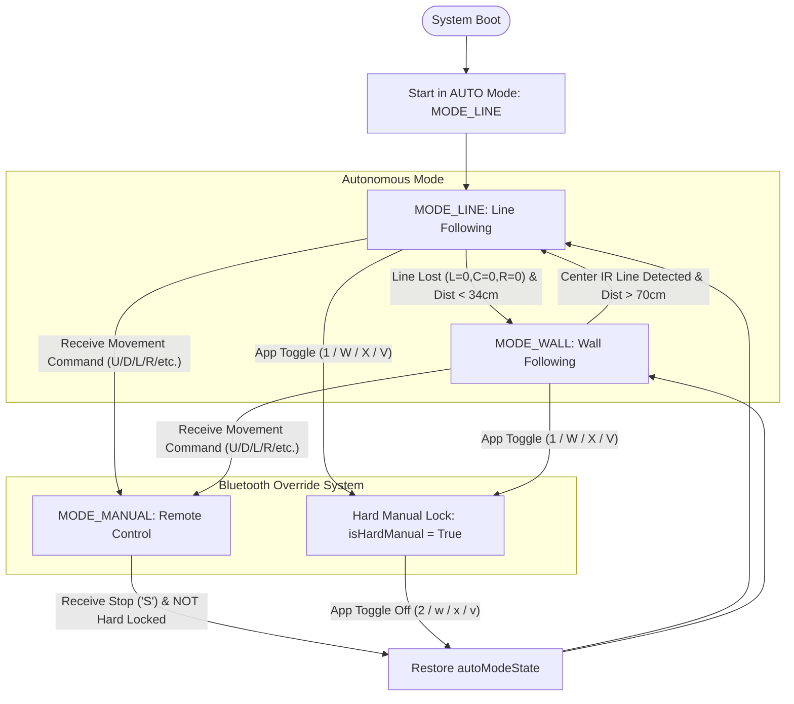

# 🤖 THE EUROPA

> **Advanced ESP32-Powered Tri-Modal Autonomous & Remote-Controlled Hybrid Robotic System**

THE EUROPA is a state-of-the-art hybrid mobile robot built on the **ESP32 microcontroller**. It features seamless tri-modal operation, seamlessly switching between **Autonomous Line Following**, **Autonomous Ultrasonic Wall Following & Obstacle Navigation**, and **Bluetooth Remote Manual Control** with intelligent state-restoration logic.

---

## 🌟 Key Features

- 🏎️ **Tri-Modal State Machine**: Smooth switching between `MODE_LINE`, `MODE_WALL`, and `MODE_MANUAL`.
- 🛤️ **High-Precision Line Following**: Reads 3 IR line sensors (`Left`, `Center`, `Right`) for trajectory adjustment.
- 🦇 **Ultrasonic Wall Following & Maze Navigation**: Employs 3 `NewPing` HC-SR04 sonar sensors (`Left`, `Front`, `Right`) to maintain fixed distances from walls and navigate obstacles.
- 🔄 **Smart Autonomous Mode Transition**:
  - Automatically transitions from **Line Follow ➔ Wall Follow** when the line is lost and walls are detected within `34 cm`.
  - Automatically transitions back from **Wall Follow ➔ Line Follow** when the center IR sensor detects a line and open side space (`> 70 cm`) is detected.
- 📲 **Dual-Tier Bluetooth Control ("THE EUROPA")**:
  - **Temporary Manual Override**: Momentary directional controls ('U', 'D', 'L', 'R', diagonals) instantly take control. Releasing the control ('S') automatically resumes the previous autonomous state (`LINE` or `WALL`).
  - **Hard Manual Lock**: Toggle keys ('1', 'W', 'X', 'V') lock the bot into full manual mode, indicated via `CH1_PIN` (built-in LED). Toggling off ('2', 'w', 'x', 'v') restores autonomous mode.

---

## 🔄 Mode State Flowchart



---

## 📌 ESP32 Pin Allocation & Hardware Wiring

### 1. IR Line Sensors
| Sensor Name | ESP32 Pin | Description |
| :--- | :---: | :--- |
| `left_ir` | **GPIO 34** | Left IR Reflectance Sensor |
| `center_ir` | **GPIO 35** | Center IR Reflectance Sensor |
| `right_ir` | **GPIO 32** | Right IR Reflectance Sensor |

### 2. Motor Driver (L298N / H-Bridge) & PWM Control
| Signal Name | ESP32 Pin | Function |
| :--- | :---: | :--- |
| `leftmotor1` (IN1) | **GPIO 18** | Left Motor Direction Pin 1 |
| `leftmotor2` (IN2) | **GPIO 17** | Left Motor Direction Pin 2 |
| `rightmotor1` (IN3) | **GPIO 22** | Right Motor Direction Pin 1 |
| `rightmotor2` (IN4) | **GPIO 21** | Right Motor Direction Pin 2 |
| `ENA` | **GPIO 16** | Left Motor PWM Speed Control |
| `ENB` | **GPIO 19** | Right Motor PWM Speed Control |

### 3. Ultrasonic Sonar Array (HC-SR04)
| Sonar Module | Trigger Pin | Echo Pin | Function |
| :--- | :---: | :---: | :--- |
| **Left Sonar** | **GPIO 25** | **GPIO 26** | Left wall distance measurement |
| **Front Sonar** | **GPIO 27** | **GPIO 14** | Front obstacle & wall distance |
| **Right Sonar** | **GPIO 33** | **GPIO 13** | Right wall distance measurement |

### 4. Auxiliary Indicators & Channels
| Pin Name | ESP32 Pin | Function |
| :--- | :---: | :--- |
| `CH1_PIN` | **GPIO 2** | Channel 1 / On-board LED (Hard Manual Lock Indicator) |
| `CH2_PIN` | **GPIO 23** | Channel 2 Output |

---

## 🎮 Bluetooth Control Protocol

Broadcast Name: **`THE EUROPA`**  
Recommended App: **SriTu Hobby App** or standard Bluetooth Serial RC Controller.

| Command Key | Action / Movement | Mode Impact |
| :---: | :--- | :--- |
| **`U`** | Move Forward | Temporary Manual Override |
| **`D`** | Move Backward | Temporary Manual Override |
| **`L`** | Turn Left | Temporary Manual Override |
| **`R`** | Turn Right | Temporary Manual Override |
| **`T`** | Forward-Left Diagonal | Temporary Manual Override |
| **`F`** | Forward-Right Diagonal | Temporary Manual Override |
| **`H`** | Backward-Left Diagonal | Temporary Manual Override |
| **`G`** | Backward-Right Diagonal | Temporary Manual Override |
| **`S`** | Stop Motor | Restores `autoModeState` (if not hard locked) |
| **`1` / `W` / `X` / `V`** | Lock Hard Manual Mode | Enables `isHardManual`, LED ON (`GPIO 2`) |
| **`2` / `w` / `x` / `v`** | Unlock Hard Manual Mode | Restores Auto Mode, LED OFF (`GPIO 2`) |

---

## ⚙️ Performance Parameters & Tuning Constants

```cpp
// Speed Parameters (0-255)
BASE_SPEED    = 120   // Standard forward speed in AUTO mode
TURN_SPEED    = 100   // Turning speed in AUTO mode
MOTOR_SPEED   = 120   // Normal speed in MANUAL mode
DIAGONAL_FAST = 150   // Outer wheel speed for diagonal motion
DIAGONAL_SLOW = 150   // Inner wheel speed for diagonal motion

// Distance Thresholds (cm)
WALL_DIST     = 15    // Target distance from wall
FRONT_STOP    = 25    // Front obstacle avoidance trigger
SWITCH_DIST   = 34    // Distance threshold to switch from LINE -> WALL mode

// PWM Settings
PWM_FREQ       = 4000  // 4 kHz PWM Frequency
PWM_RESOLUTION = 8     // 8-bit resolution (0 - 255)
```

---

## 🛠️ Software Dependencies & Requirements

1. **Arduino IDE** (v1.8.x or v2.x) with **ESP32 Core** installed.
2. Required Libraries:
   - **`BluetoothSerial`** (Built-in with ESP32 Arduino Core)
   - **`NewPing`** (Install via Arduino Library Manager)

---

## 🚀 Getting Started

1. Clone this repository:
   ```bash
   git clone https://github.com/sakshyambhttr-cyber/EUROPA_BOT.git
   ```
2. Open `EUROPA_BOT.ino` in the Arduino IDE.
3. Select your ESP32 board (e.g., **ESP32 Dev Module**) under `Tools > Board`.
4. Connect the ESP32 via USB and select the appropriate COM port.
5. Compile and upload the sketch.
6. Pair your Android smartphone to Bluetooth device **`THE EUROPA`** using SriTu Hobby App.

---

## 📄 Repository Structure

```
EUROPA_BOT/
├── EUROPA_BOT.ino    # Complete ESP32 Control Sketch (Line/Wall Follow & Bluetooth)
└── README.md         # Full Hardware, Software, & Pinout Documentation
```

---

## 👤 Author

**Sakshyam Bhattarai** ([@sakshyambhttr-cyber](https://github.com/sakshyambhttr-cyber))
